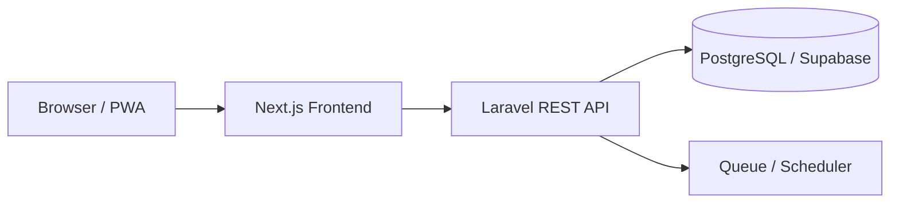

# Architecture

## Gambaran



## Tanggung jawab

### Next.js

- UI public dan dashboard berdasarkan role.
- Form validation untuk pengalaman pengguna.
- Session client dan pemanggilan Laravel API.
- Middleware route guard sebagai lapisan UX, bukan sumber otorisasi.
- Mobile-first untuk Sales; desktop-first namun responsive untuk Super Admin.

### Laravel

- Sumber kebenaran otorisasi dan business rules.
- Tenant scoping.
- State transition SA.
- Target, leaderboard, dan kalkulasi komisi.
- Audit log, subscription gate, API resource, job, dan scheduler.
- Laravel Sanctum untuk autentikasi.

### PostgreSQL/Supabase

- Penyimpanan data relasional.
- Constraint, foreign key, unique index, dan transaksi.
- Supabase bukan jalur langsung business data dari frontend pada arsitektur MVP.

## Struktur backend target

```text
backend/
├── app/
│   ├── Actions/SalesActivity/
│   ├── Enums/
│   ├── Http/Controllers/Api/V1/
│   ├── Http/Requests/
│   ├── Http/Resources/
│   ├── Models/
│   ├── Policies/
│   └── Services/CommissionService.php
├── database/migrations/
├── routes/api.php
└── tests/Feature/
```

## Struktur frontend target

```text
frontend/
├── app/
│   ├── (public)/
│   ├── admin/
│   ├── spv/
│   └── sales/
├── components/
├── features/
├── lib/api/
├── types/
└── public/
```

## Pola implementasi

- Controller tipis; aturan bisnis berada pada Action/Service dan Policy.
- Gunakan enum untuk role/status.
- Validasi input melalui Form Request.
- Response melalui API Resource.
- Kalkulasi komisi berjalan dalam transaksi dan idempotent.
- Aggregation dapat dihitung saat request dahulu; cache/materialized summary ditambahkan setelah ada bukti kebutuhan.

## Keamanan

- Authorization diperiksa backend pada setiap resource.
- Rate limit login dan endpoint sensitif.
- Bukti upload dibatasi tipe/ukuran dan disimpan private.
- Jangan log password, token, atau data pelanggan sensitif.
- CORS hanya mengizinkan origin frontend resmi.
- Secret hanya melalui environment variable.

## Pengujian prioritas

1. Tenant isolation.
2. Role/policy dan kepemilikan tim.
3. Transisi status SA dan audit history.
4. Target hanya dari validated SA.
5. Commission formula, tier boundary, idempotensi, dan snapshot.
6. Subscription gate.
