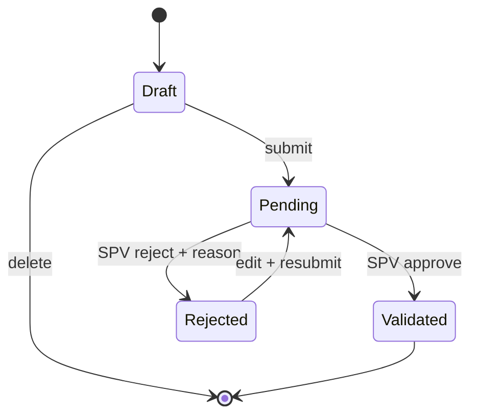

# Business Rules

## 1. Tenant isolation

1. Setiap data bisnis memiliki `company_id` langsung atau dapat diturunkan secara tidak ambigu melalui relasi.
2. Query wajib dibatasi ke company user terautentikasi.
3. `company_id`, `team_id`, dan `sales_id` dari klien tidak boleh dipercaya tanpa pemeriksaan kepemilikan.
4. Tidak ada SPV atau Sales yang dapat membaca atau mengubah data perusahaan lain.

## 2. Role dan keanggotaan

- Super Admin berada pada ruang sistem.
- SPV dan Sales berada pada company.
- Sales wajib menjadi anggota tim aktif untuk mengirim SA.
- SPV hanya memvalidasi SA dari tim yang dikelolanya.
- Perpindahan tim tidak mengubah histori SA lama.

## 3. Lifecycle SA

- Pemilik dapat mengubah draft dan rejected.
- Pending tidak dapat diedit oleh sales.
- Reject wajib menyimpan alasan.
- Validated bersifat final pada MVP.
- Semua transisi menyimpan actor, status asal, status tujuan, alasan, dan timestamp.
- Nama “SA” dapat diganti SPV sebagai label tampilan, tetapi nama entity internal tetap stabil.

## 4. Periode input

- Tanggal aktivitas tidak boleh di masa depan.
- Default batas input/resubmit adalah 2×24 jam setelah tanggal aktivitas.
- SPV dapat diberi mekanisme override dengan alasan dan audit pada fase berikutnya.
- Periode target/komisi mengikuti zona waktu company.

## 5. Target

- Target memiliki tipe `weekly` atau `monthly`, periode mulai/selesai, nilai target, dan sales tujuan.
- Target per sales dapat berbeda.
- Capaian dihitung dari SA tervalidasi dengan `activity_date` dalam periode.
- Pending, rejected, dan draft tidak dihitung.
- Persentase = `validated_count / target_value × 100`; target nol ditampilkan sebagai belum diatur, bukan 0%.

## 6. Produk

- Product Fee didefinisikan per produk dan company.
- Produk nonaktif tidak dapat dipilih untuk SA baru, tetapi histori tetap dapat dibaca.
- SA menyimpan referensi produk; snapshot nama/fee yang diperlukan disimpan pada hasil komisi.

## 7. Komisi

### Rumus

`commission_total = (product_fee_total × multiplier_value) + progressive_total`

### Product Fee

`product_fee_total = Σ fee produk untuk setiap SA tervalidasi`

### Multiplier

- Aturan berbentuk rentang jumlah SA dan nilai multiplier.
- Maksimal satu aturan aktif yang cocok untuk satu jumlah SA pada satu skema.
- Jika fitur dinonaktifkan atau tidak ada aturan cocok, multiplier = 1.

### Progressive Incentive

- Dihitung menurut urutan SA tervalidasi per produk dalam satu periode.
- Contoh: urutan 1 = 50k, urutan 2 = 50k, urutan 3 = 100k menghasilkan 200k.
- Jika urutan melebihi tier terakhir, perilakunya wajib ditentukan oleh setting (`repeat_last` atau `zero`); default MVP `zero`.

### Snapshot dan idempotensi

- Hasil menyimpan product fee, multiplier, progressive incentive, formula/version, dan total.
- Kalkulasi ulang untuk sales+periode memperbarui satu record secara transaksional, bukan membuat duplikat.
- Perubahan skema tidak mengubah histori yang sudah dikunci kecuali dilakukan recalculation eksplisit dan diaudit.

## 8. Leaderboard

- Hanya SA tervalidasi yang dihitung.
- Scope dibatasi company dan, bila diterapkan, team.
- Urutan: validated count menurun; sales value menurun; timestamp capaian lebih awal.
- User nonaktif dapat disembunyikan dari leaderboard aktif tanpa menghapus historinya.

## 9. Subscription

- Company baru memperoleh trial Starter selama 3 hari.
- Hanya satu subscription berjalan per company.
- Status trialing/active dapat membuat dan mengubah data.
- Status expired/cancelled memblokir mutasi berbayar.
- Payment gateway dan auto-charge tidak boleh dianggap berhasil tanpa webhook terverifikasi.

## 10. Uang, waktu, dan audit

- Uang tidak menggunakan floating point.
- Database menyimpan timestamp dalam UTC.
- Zona waktu company digunakan untuk batas minggu/bulan dan tampilan.
- Aksi penting: login sensitif, perubahan role, target, skema komisi, validasi, subscription, dan pembayaran dicatat.

## 11. Invariant

- SA tervalidasi tidak dapat diedit atau divalidasi dua kali.
- History status tidak boleh hilang ketika SA berubah.
- Satu user tidak boleh mengakses tenant lain.
- Satu sales+periode hanya memiliki satu snapshot komisi aktif per versi kalkulasi.
- Jumlah pada dashboard, leaderboard, target, dan komisi berasal dari definisi SA tervalidasi yang sama.
