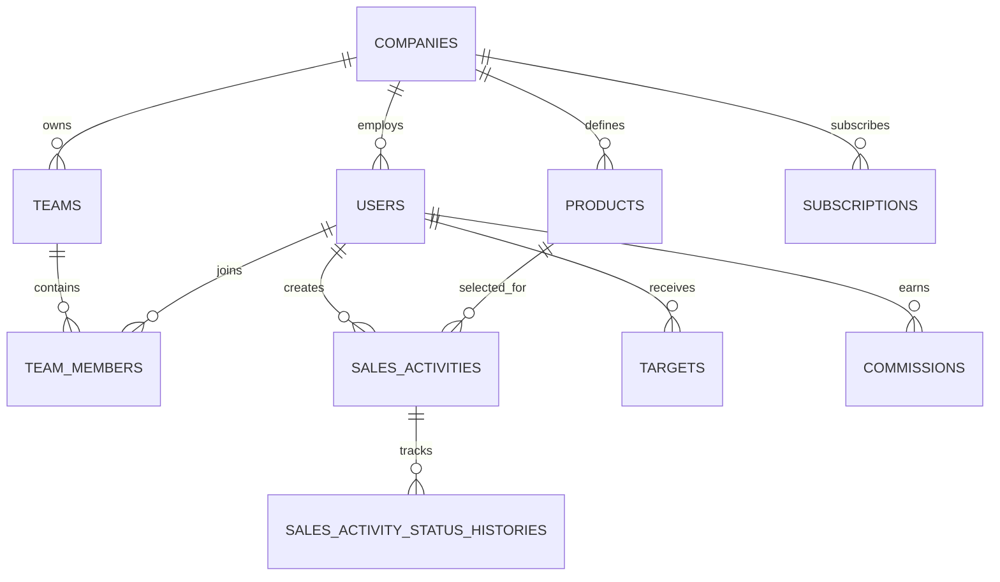

# Entity Relationship Design

## Diagram inti

## Tabel

### companies

- `id` uuid PK
- `name`, `slug`
- `activity_label` default `SA`
- `timezone` default `Asia/Jakarta`
- `status`
- timestamps

### users

- `id` uuid PK
- `company_id` uuid nullable FK
- `name`, `email`, `password`
- `role`: `super_admin|spv|sales`
- `is_active`
- timestamps

### teams

- `id`, `company_id`, `name`
- `supervisor_id` FK users
- `is_active`, timestamps

### team_members

- `id`, `company_id`, `team_id`, `user_id`
- `joined_at`, `left_at`, timestamps
- unique active membership sesuai aturan MVP

### products

- `id`, `company_id`, `name`, `code`
- `product_fee_amount`
- `is_active`, timestamps

### sales_activities

- `id`, `company_id`, `team_id`, `sales_id`, `product_id`
- `activity_date`, `customer_reference`, `notes`, `evidence_path`
- `status`: `draft|pending|validated|rejected`
- `submitted_at`, `validated_at`, `validated_by`
- `rejection_reason`
- timestamps, soft deletes untuk draft bila dibutuhkan

### sales_activity_status_histories

- `id`, `company_id`, `sales_activity_id`
- `from_status`, `to_status`, `actor_id`, `reason`
- `created_at`

### targets

- `id`, `company_id`, `sales_id`
- `type`: `weekly|monthly`
- `period_start`, `period_end`, `target_value`
- `created_by`, timestamps

### commission_settings

- `id`, `company_id`, `version`
- `multiplier_enabled`, `progressive_enabled`
- `progressive_overflow_behavior`
- `effective_from`, `effective_until`, `is_active`
- timestamps

### commission_product_fees

- `id`, `company_id`, `commission_setting_id`, `product_id`
- `fee_amount`

### commission_multiplier_rules

- `id`, `company_id`, `commission_setting_id`
- `min_sa`, `max_sa`, `multiplier_value`

### commission_progressive_rules

- `id`, `company_id`, `commission_setting_id`, `product_id`
- `sequence_number`, `incentive_amount`

### commissions

- `id`, `company_id`, `team_id`, `sales_id`
- `period` (`YYYY-MM` untuk agregat bulanan)
- `product_fee_amount`, `multiplier_value`
- `progressive_incentive_amount`, `total_amount`
- `formula_snapshot` jsonb, `calculation_version`
- `calculated_at`, `locked_at`, timestamps
- unique `(company_id, sales_id, period, calculation_version)`

### subscriptions

- `id`, `company_id`, `plan_code`
- `status`, `trial_ends_at`, `starts_at`, `ends_at`
- `provider`, `provider_subscription_id`
- timestamps

### payments

- `id`, `company_id`, `subscription_id`
- `amount`, `status`, `provider_reference`
- `paid_at`, timestamps

### audit_logs

- `id`, `company_id`, `actor_id`
- `event`, `auditable_type`, `auditable_id`
- `before` jsonb, `after` jsonb, `metadata` jsonb
- `created_at`

## Index penting

- `(company_id, status, activity_date)` pada `sales_activities`.
- `(company_id, team_id, status)` untuk antrean validasi.
- `(company_id, sales_id, activity_date)` untuk dashboard.
- `(company_id, sales_id, period_start, period_end)` pada `targets`.
- Semua foreign key dan idempotency key webhook/payment bila integrasi ditambahkan.
